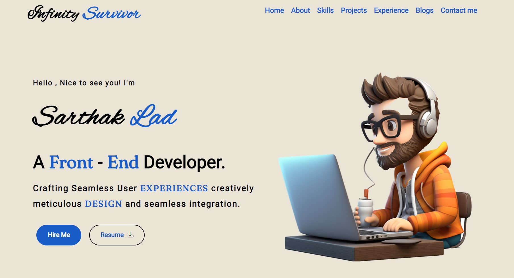

# Portfolio Website using HTML and CSS

The Responsive Portfolio Website project is a visually appealing and user-friendly personal portfolio site built using HTML and CSS. Designed to adapt seamlessly to various screen sizes, this project ensures an optimal viewing experience across devices. 



## Description

* Consistent color scheme and typography.
* Use of CSS Grid and Flexbox for layout management.
* Media queries to handle different screen sizes.
* Interactive elements like hover effects and animations.

## Getting Started

To get started with this project, follow these steps:

1. Clone the repository:

```bash

git clone https://github.com/Sarthaklad1034/Portfolio-Website-using-HTML-and-CSS.git
```

2. Open the project in your preferred code editor.

3. Launch the `index.html` file in a web browser to view the home page.

4. Feel free to modify the code and customize the page according to your preferences. You can update the content, change the colors, or add new features.

## Contributing

Contributions to this project are welcome. If you find any issues or have suggestions for improvements, please open an issue or submit a pull request.

## License

This project is licensed under the [MIT License](LICENSE). Feel free to use the code for personal or commercial purposes.

## Credits
* [Scaler Tutorial](https://www.scaler.com/topics/portfolio-project-css/)

## Contact

If you have any questions, suggestions, or feedback, you can reach out to the project maintainer:

- Linkedin : [sarthak-lad](https://linkedin.com/in/sarthak-lad)
- Email: [sarthaklad1034@gmail.com](mailto:sarthaklad1034@gmail.com)

---

Enjoy exploring the code and creating your own Portfolio Website!
